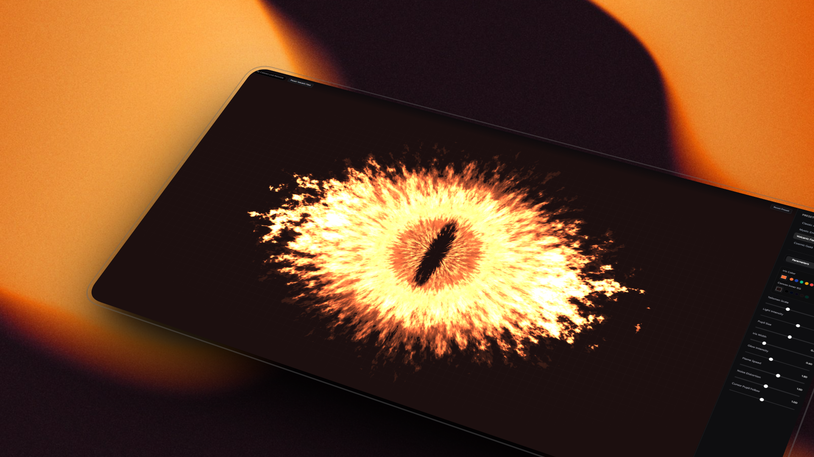

# 🧿 WebGL Interactive Evil Eye

An interactive, ultra-premium, GPU-accelerated WebGL application representing a procedural **Evil Eye (Nazar Amulet)**. This project leverages raw mathematics, polar mappings, and fractal brownian motion noise running in a custom fragment shader, all wrapped in a sleek glassmorphic dashboard interface.



## ✨ Live Demo & Interactive Features

*   **GPU-Accelerated Procedural Shader:** Single-triangle WebGL setup rendering an organic procedural eye using custom multi-octave Value Noise.
*   **Dynamic Pupil Tracking:** JavaScript feeds coordinates, aspect ratios, and custom configuration values directly into GLSL uniforms at 60 FPS with custom follow inertia.
*   **Sleek Glassmorphic Control Panel:** A premium sidebar with glassmorphic backdrop-filters, custom indicators with smooth physical sliding animations (`cubic-bezier` spring transition), and clean custom slider controls.
*   **Procedural Presets:** Switch instantly between unique configurations:
    *   **Classic Amulet** 🔵 (Deep cobalt blue iris, mystic vibes)
    *   **Mystic Emerald** 🟢 (Vibrant green iris, high noise speed)
    *   **Volcanic Flare** 🟠 (Orange-red burning fire iris, high distortion)
    *   **Cosmic Gold** 🟡 (Procedural cosmic golden aura, slow burning flame)

---

## 🛠️ Tech Stack & Key Abstractions

*   **Core Canvas Engine:** [OGL](https://github.com/oogl/ogl) — A minimal, high-performance WebGL library.
*   **Frontend & State:** React + Vite (Fast HMR development server).
*   **Animations:** Framer Motion (for tab transitions) & CSS transitions.
*   **Styling:** Tailwind CSS (Modern dark aesthetics).
*   **Typography:** Google Sans Flex & Outfit.

---

## 🧬 How It Works (Shader Mathematics)

The visual magic is calculated pixel-by-pixel within the custom fragment shader:

1.  **Polar Coordinate Mapping:** Standard Cartesian planar UV coordinates are converted into polar coordinates $(r, \theta)$ to structure the organic, radial nature of the iris fibers.
2.  **Fractal Brownian Motion (FBM):** Three layered noise textures (`noiseA`, `noiseB`, `noiseC`) are sampled at varying frequencies, speed offsets, and scales to create organic, fluid-like flame distortion in real-time.
3.  **Mouse coordinate Uniforms:** JavaScript captures mouse movements relative to the canvas boundary, applies a lerp (linear interpolation) smoothing factor, and updates the `uMouse` uniform to smoothly drag the pupil element.

---

## ⚙️ Parameters Customized

Using the glassmorphic sidebar, you can fine-tune every component of the procedural eye in real time:

*   **Talisman Scale:** Overall size of the procedural amulet on the canvas.
*   **Light Intensity:** Brightness, color blending, and contrast threshold of the iris fibers.
*   **Pupil Size:** Size of the dynamic horizontal center pupil shape.
*   **Iris Width:** Width of the detailed fiber ring.
*   **Glow Intensity:** Outer cosmic aura light radius.
*   **Flame Speed:** Animation velocity of the fractal noise layers.
*   **Noise Distortion:** Scale and octave multiplier of the value noise FBM.
*   **Cursor Pupil Follow:** Tracking boundary multiplier for how far the pupil follows the mouse pointer.
*   **Canvas Inner BG:** The radial color gradient surrounding the WebGL program.

---

## 🚀 Getting Started

To run the project locally:

1. Clone the repository.
2. Install the dependencies:
   ```bash
   npm install
   ```
3. Run the Vite development server:
   ```bash
   npm run dev
   ```
4. Build the highly-optimized production bundle:
   ```bash
   npm run build
   ```

---

## 👤 Credits

Created with passion by [Sebastián Vásquez Echavarría](https://sebas-dev.vercel.app/).
